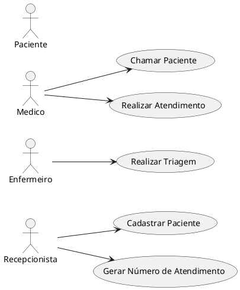

# ClinicaWeSearch - Sistema de Atendimento

## Diagramas

### Diagrama de Caso de Uso (UML)


### Diagrama de Fluxo de Dados (DFD)
```plantuml
graph TD
    A[Paciente] -->|Dados do Paciente| B{1. Registro de Paciente na Recepção};
    B -->|Dados do Paciente Registrados| C[Sistema de Informações];
    C -->|Número de Atendimento| D{2. Geração de Número de Atendimento};
    D -->|Número de Atendimento| A[Paciente];
    D -->|Número de Atendimento| E{3. Processo de Triagem};
    E -->|Dados da Triagem| C;
    C -->|Dados da Triagem| A[Paciente];
```
### Modelagem de Dados
```sql
CREATE DATABASE SistemaSaude;

USE SistemaSaude;

-- Tabela de Pacientes
CREATE TABLE Pacientes (
    Id INT PRIMARY KEY IDENTITY,
    Nome VARCHAR(255) NOT NULL,
    Telefone VARCHAR(20),
    Sexo CHAR(1),
    Email VARCHAR(255) NOT NULL UNIQUE
);

-- Tabela de Atendimentos
CREATE TABLE Atendimentos (
    Id INT PRIMARY KEY IDENTITY,
    NumeroSequencial INT NOT NULL,
    PacienteId INT,
    DataHoraChegada DATETIME NOT NULL DEFAULT GETDATE(),
    Status VARCHAR(20) NOT NULL,
    FOREIGN KEY (PacienteId) REFERENCES Pacientes(Id)
);

-- Tabela de Triagens
CREATE TABLE Triagens (
    Id INT PRIMARY KEY IDENTITY,
    AtendimentoId INT,
    Sintomas TEXT,
    PressaoArterial VARCHAR(20),
    Peso DECIMAL(5, 2),
    Altura DECIMAL(4, 2),
    EspecialidadeId INT,
    FOREIGN KEY (AtendimentoId) REFERENCES Atendimentos(Id)
);
```
