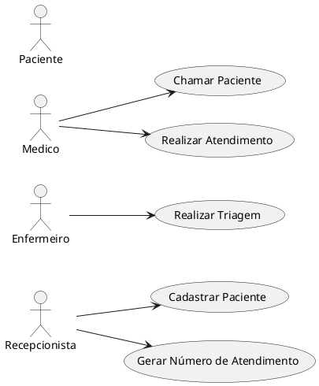

# ClinicaWeSearch - Sistema de Atendimento

## Diagramas

### Diagrama de Caso de Uso (UML)


### Diagrama de Fluxo de Dados (DFD)
```plantuml
graph TD
    A[Paciente] -->|Dados do Paciente| B{1. Registro de Paciente na Recepção};
    B -->|Dados do Paciente Registrados| C[Sistema de Informações];
    C -->|Número de Atendimento| D{2. Geração de Número de Atendimento};
    D -->|Número de Atendimento| A[Paciente];
    D -->|Número de Atendimento| E{3. Processo de Triagem};
    E -->|Dados da Triagem| C;
    C -->|Dados da Triagem| A[Paciente];
```
### Modelagem de Dados
```sql
CREATE DATABASE SistemaSaude;

USE SistemaSaude;

-- Tabela de Pacientes
CREATE TABLE Pacientes (
    Id INT PRIMARY KEY IDENTITY,
    Nome VARCHAR(255) NOT NULL,
    Telefone VARCHAR(20),
    Sexo CHAR(1),
    Email VARCHAR(255) NOT NULL UNIQUE
);

-- Tabela de Atendimentos
CREATE TABLE Atendimentos (
    Id INT PRIMARY KEY IDENTITY,
    NumeroSequencial INT NOT NULL,
    PacienteId INT,
    DataHoraChegada DATETIME NOT NULL DEFAULT GETDATE(),
    Status VARCHAR(20) NOT NULL,
    FOREIGN KEY (PacienteId) REFERENCES Pacientes(Id)
);

-- Tabela de Triagens
CREATE TABLE Triagens (
    Id INT PRIMARY KEY IDENTITY,
    AtendimentoId INT,
    Sintomas TEXT,
    PressaoArterial VARCHAR(20),
    Peso DECIMAL(5, 2),
    Altura DECIMAL(4, 2),
    EspecialidadeId INT,
    FOREIGN KEY (AtendimentoId) REFERENCES Atendimentos(Id)
);
```
## Configuração do Docker e Banco de Dados

### Pré-requisitos

* [Docker](https://www.docker.com/get-started) instalado na sua máquina.

### Passo a Passo

1.  **Criar o arquivo `docker-compose.yml`:**

    Na raiz do seu projeto, crie um arquivo chamado `docker-compose.yml` com o seguinte conteúdo:

    ```yaml
    version: '3.8'
    services:
      db:
        image: [mcr.microsoft.com/mssql/server:2019-latest](https://mcr.microsoft.com/mssql/server:2019-latest)
        environment:
          SA_PASSWORD: "#p@ssword01"
          ACCEPT_EULA: "1"
        ports:
          - "1433:1433"
        volumes:
          - sqlserver_data:/var/opt/mssql
    volumes:
      sqlserver_data:
    ```

2.  **Iniciar o contêiner do SQL Server:**

    No terminal, navegue até a pasta onde você criou o arquivo `docker-compose.yml` e execute o seguinte comando:

    ```bash
    docker-compose up -d
    ```

    * Isso irá baixar a imagem do SQL Server e iniciar o contêiner em segundo plano.

3.  **Conectar ao banco de dados:**

    Você pode usar qualquer ferramenta de gerenciamento de banco de dados que suporte SQL Server, como SQL Server Management Studio (SSMS) ou Azure Data Studio, para se conectar ao banco de dados.

    * **Servidor:** `localhost,1433`
    * **Usuário:** `sa`
    * **Senha:** `#p@ssword01`

4.  **Criar as tabelas:**

    Execute os scripts SQL para criar as tabelas do seu banco de dados. Você pode copiar e colar os scripts diretamente no SSMS ou Azure Data Studio.

    ```sql
    -- Exemplo de script para criar a tabela Pacientes
    CREATE TABLE Pacientes (
        ID INT PRIMARY KEY IDENTITY(1,1),
        Nome VARCHAR(255) NOT NULL,
        Telefone VARCHAR(20),
        Sexo VARCHAR(10),
        Email VARCHAR(255) UNIQUE
    );

    -- Adicione os scripts para as outras tabelas aqui, os mesmos se encontra na parte citada acima em modelagem de dados...
    ```

5.  **Verificar a criação das tabelas:**

    Use o SSMS ou Azure Data Studio para verificar se as tabelas foram criadas corretamente.

### Observações

* Você pode personalizar as configurações do SQL Server no arquivo `docker-compose.yml`, como a porta e os volumes.
* Lembre-se de manter a senha do administrador do SQL Server em segredo.
